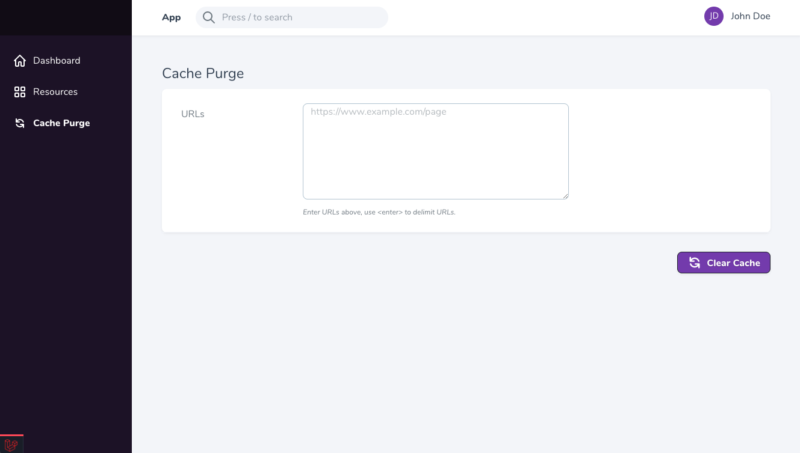
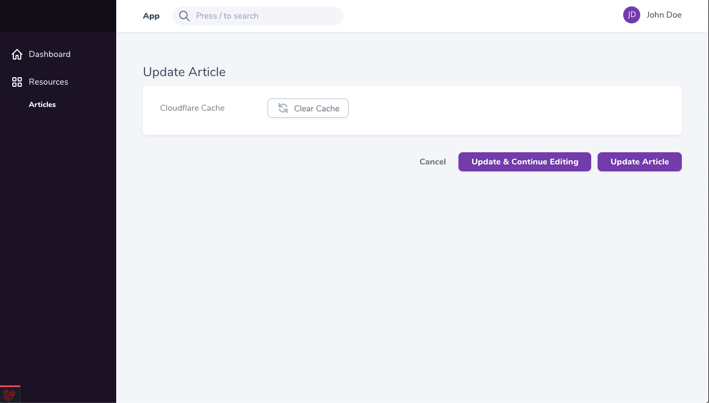

# Laravel Nova Cloudflare Tool and Field

## Features
* Laravel Nova Tool for adding a cache purge page to manually purge specific urls in batches
* Laravel Nova Field for cache purging specific urls or Cache Tags for a resource
* Option to include either the Tool, Field, or both in project
* Option to use urls, Cache Tag header, or both for purging Cloudflare cache 

##### Nova Tool:


##### Nova Field:


## Installation

* Install the package into your Laravel application. 

```console
composer require ziffmedia/laravel-cloudflare
```

* Publish the config file to your application.

```console
   php artisan vendor:publish --provider="ZiffMedia\LaravelCloudflare\CloudflareServiceProvider" --tag="config" 
```

* Provide the new config file your Cloudflare Zone and API keys in your .env files.


## Nova Tool Integration

To provide the cache purge Tool in your Nova instance, you must register the Tool with your NovaServiceProvider:

```php
// app/Providers/NovaServiceProvider.php

use ZiffMedia\LaravelCloudflare\Nova\Tools\LaravelCloudflareTool;

public function tools()
{
    return [
        // ...,
        LaravelCloudflareTool::make()
    ];
}
```

For adding permissions to the Tool, please see the Nova [documentation](https://nova.laravel.com/docs/1.0/customization/tools.html#authorization "Nova Tool Documentation").

Note: The Tool is intended only for urls; setup for Cache Tags is not required if only using the Tool or url purging.

## Nova Field Integration

To provide the Cache Purge button on any resource, you must reference the Field and make sure that you have setup the appropriate purge method (url or Cache Tag).

```php
// app/Nova/

use ZiffMedia\LaravelCloudflare\Nova\Fields\ClearCacheButton;

public function fields(Request $request)
{
    ClearCacheButton::make('Cloudflare Cache')
        ->purgeUrls(
            ['https://www.example.com', 'https://www.example.com/page']
        )
        ->purgeTags(function () {
            return $this->cloudflareTagsToClear(); // In order to use this method, you must setup Cache Tags (see below)
        })
        ->hideWhenCreating()
}
```

## Cloudflare Cache-Tag Header Integration

Cloudflare has the ability to use a special Cache-Tag header on requests to purge multiple pages instantly. If you intend to only use url purging, you can skip this step. In order to setup the Cache-Tag header, follow the below steps:

* Add the Cloudflare Cache-Tag middleware to automatically add the Cache-Tag header to all requests. Because Cloudflare automatically removes the headers, you can use `debug_cache_tags=1` in the querystring of requests to see the output of the header.

```php
// app/Http/Kernel.php

use ZiffMedia\LaravelCloudflare\Middleware\CloudflareTagHeaders;

protected $middlewareGroups = [
    'web' => [
        // ...
        CloudflareTagHeaders::class,
    ]
];
```

* Add the Cloudflare controller concern to tell the page which tags to give the header request. Here is an example implementation for an Article resource:

```php
// app/Http/Controllers/ArticleController.php

use ZiffMedia\LaravelCloudflare\Controllers\Concerns\CloudflareTaggable;

class ArticleController extends Controller
{
    use CloudflareTaggable;

    public function index()
    {
        // For a collection of models
        $articles = Article::get();
        $this->addCloudflareTagsFromCollection($articles); // This will add a tag to the page for each model in the collection
        
        // For a single model
        $article = Article::first();
        $this->addCloudflareTagFromModel($article); // This will add a tag to the page for a single model
                
        return view(...);
    }
}
```

* Add the Cloudflare model concern to tell the headers which tag to use for a model. Additionally, the `cloudflareTagsToClear` and `cloudflareTag` methods can be overwritten to allow for customization of tags or purging of additional resources. Here is a basic example implementation for an Article model:

```php
// app/Models/Article.php

use ZiffMedia\LaravelCloudflare\Models\Concerns\CloudflareTaggable;

class Article extends Model
{
    use CloudflareTaggable;
    // ...   
}
```

## Config Options

* `purge_enabled`: Allows for purging to be turned on or off
* `email`: Email address used for authenticating with Cloudflare API
* `key`: Key used to authenticate with Cloudflare API
* `zone`: Zone used for Cloudflare API
* `domains`: An array of domains which are allowed to be purged. All url purge requests will be validated against these domains, if any.

